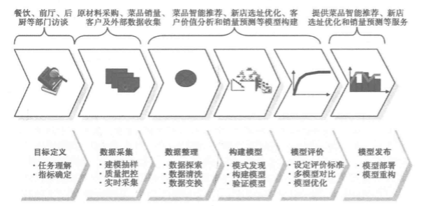

### 第一章 数据挖掘基础

1. 某知名连锁餐饮企业的困惑 
     实践情景设定:信息化后的餐饮连锁公司面对市场经济的挑战。

2. 从餐饮服务到数据挖掘
    企业目标：盈利 
    餐饮企业核心：菜品和顾客
    历史性数据分析:

    * 推荐菜品可以提高销量，减少点餐时间和频率。提高用户体验
    * 历史销售情况，考虑节假日、气候、竞争对手等因素的销售情况对菜品的销量预测以备提前准备材料。
    * 菜品销售量定期统计，分类出好评和差评，为促销活动和新菜品推出做支持。
    * 根据就餐习惯和消费金额对客户进行筛选出优质客户，提高服务水平。

3. 数据挖掘的基本任务
    基本任务包含：分类和预测、聚类分析、关联规则、时序模式、偏差检验、智能推荐等。从数据中提取商业价值。

4. 数据挖掘建模过程
    * 定义挖掘的目标 
        明确挖掘目标，明确完成效果。需要分析应用目标了解用户需求。
          
        所以可以取出一下目标:
        - 菜品智能推荐。  
        - 客户细分和画像，了解不通需求，精准化营销。
        - 菜品历史销售情况对物资的支持。
        - 餐饮大数据的店址选择和口味分析。

    * 数据取样  
        - 取样标准：相关性、可靠性、有效性。

        - 不可忽视数据的质量问题，衡量数据质量的方式：  

          + 资料的完整无缺，指标项齐全。

          + 数据的准确无误，为正常数据，不在异常指标状态的水平。

        数据抽样的方式：  
        * 随机抽样
        * 等距抽样
        * 分层抽样
        * 从起始顺序抽样
        * 分类抽样

    * 数据探索
      对样本数据的提前探索和预处理是保证模型质量的重要条件。

      数据探索主要包括：异常值分析、缺失值分析、相关分析、周期性分析等。

    * 数据预处理

        采集数据过大的时候，怎么降维处理，怎么做缺失值处理都是使用数据预处理来完成的。采样的数据中同样会有噪声，不完整，不一致的数据也需要做预处理准备。

        数据预处理主要包括：数据筛选、数据变量转换、缺失值处理、坏数据处理、数据标准化、主成分分析、属性选择、数据约规等。

    * 挖掘建模

        完成与处理后，思考问题：本次建模是属于数据挖掘中的哪一类(分类、聚类、关联规则、时序模式或者智能推荐)，是要使用什么样的算法来构建模型？这一步是核心关键。

    * 模型评价

        从建模之后得出来一些分析结果，从而找到一个最好的模型。做出根据业务对模型的解释和应用。

