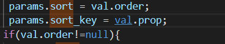
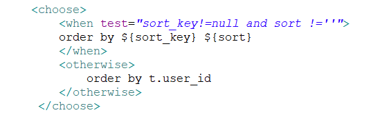

### 2018/12/7
[mac上好用的网络工具surge](https://www.nssurge.com/)     
[JS文档](https://developer.mozilla.org/zh-CN/)     
[Axios的使用说明](https://www.kancloud.cn/yunye/axios/234845)     

前端页面排序的时候要把sortable设置成custom，然后调用个方法把你要根据哪个字段排序发给后端。后端排序后返回。      
ex: 要以日期排序，前端AJAX请求的时候带上排序参数，后端返回按照参数排序好的结果集。变更排序关键字时，重新请求一边。     


axiox向flask传递参数的两种方法：
1. 使用querystring格式化后，使用fromdata提交数据
```js
fromatstart (index, row) {
    this.Axios({
        method: 'post',
        url: '/api/formatchage',
        data: this.Qs.stringify({filename: row.name_file})
      })
        .then(console.log(row.name_file))
        .catch(function (err) { console.log(err) })
}
```
```python
@app.route('/formatchage', methods=['POST'])
def formatchagefile():
    filename = response.form['filename']
```

2. 使用payload提交数据,提交的数据是json格式
```js
fromatstart (index, row) {
    this.Axios({
        method: 'post',
        url: '/api/formatchage',
        data: {filename: row.name_file}
      })
        .then(console.log(row.name_file))
        .catch(function (err) { console.log(err) })
}
```
```python
@app.route('/formatchage', methods=['POST'])
def formatchagefile():
    filename = response.json['filename']
```
### 2018/12/10     
使用element-ui vue组件的时候，请注意父子组件如果有bind绑定时候要注意方法方式和变量名称的相同。

### 2018/12/11
将npm源改为taobao源     
npm config set registry http://registry.npm.taobao.org/     

将npm源改为官方源     
npm config set registry https://registry.npmjs.org/     

一次性使用淘宝源     
npm install MODELNAME --registry http://registry.npm.taobao.org/      


### 2018/12/13
flask-sqlalchemy 转换成 JSON格式的方法：
1. 重载JSON模块
2. model中定义格式转换方法


### 2018/12/18
1. flask-sqlalchemy 从mysql中读取datetime的时候返回的结果是datetime.datetime直接可以使用strftime格式化，注意的是字段内容为空的时候会报无方法的错误，请做非空判断。
```python
# 假设uploadtime是返回的datetime结果
uploadtime.strftime("%Y-%m-%d %H:%M:%S")
```
2. [girkraken](https://www.gitkraken.com/)是一个和sourcetree一样好用的gitUI工具。
3. [sqlalchemy](https://www.sqlalchemy.org/)已经被墙，请直接梯子。


### 2018/12/22
1. element、iview和antd       
  ele和iview的slider组件，设置了分段刻度后，只能拉到分段的位置上，antd就可以拉到非分段的位置，当初用被iview这个坑了一下。
2. 好用的离线各类语言的文档：[dash](https://kapeli.com/dash)