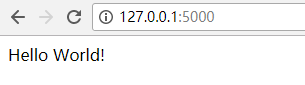

>工欲善其事，必先利其器具。 ——《论语.卫灵公》

---

**目标：使用FLASK做一个数据可视化小应用。**

---

首先，我们要安装python和flask。

python的安装我们这里就略过了，主要我们要安装flask并且按照flask官方教学来做一个最简单的flask应用。

>[flask官网](http://flask.pocoo.org/)   官方网站英文内容
>[flask中文](http://www.pythondoc.com/flask/index.html)  感谢网络上的小伙伴带来的中文翻译

因为我是在windows的环境下做的开发，所以使用liunx环境的话，可能有所不一样。

* 安装virtualenv
virtualenv不仅仅是使用在这一次的flask摆弄中，其功能如名，用来创建不同环境。当我们开发不同的项目的时候，会需要很多不同版本的python库，往往有些库会产生冲突导致兼容性错误。而virtualenv通过一种便捷方式来解决了这个问题。

    安装virtualenv的命令
    ```
    pip install virtualenv  #在CMD中使用该命令来安装virtualevn
    ```
    在安装成功后，来创建一个虚拟环境。
    ```
    mkdir python-flask  #创建了一个python-flask的文件夹
    cd python-falsk       
    virtualenv env      #在python-flask中创建虚拟环境
    cd  env\scripts     
    activate            #激活虚拟的pyhton环境。
    deactivate          #离开环境
    ```

* 安装flask
flask是一个"微"框架，并不包含数据库抽象层，表单验证或者任何其它现有的库，但是flask本身是有很多的扩展，通过扩展我们可以实现各种需求。

    ```
    pip install flask
    ```
    这里将安装是flask最新的稳定版，如果你需要特定版本号的，在flask后面添加版本好来安装。
    ```
    pip install flask==0.10.1
    ```
    **备注：在虚拟环境下安装请先进入虚拟环境目录并使用activate后再使用pip命令**


* 做一个简单的flask应用
 
    安装好后，我们使用自己的IDE开始创建一个flask应用。我自己使用的是pycharm
    >[pycharm官网](https://www.jetbrains.com/pycharm/) pycharm的下载地址，可以免费使用community版


    创建一个新的pyhton文件demo.py，并输入一下代码
    ```
    from flask import Flask

    app = Flask(__name__)

    @app.route('/')
    def hello_world():
        return 'Hello World!'

    if __name__ == '__main__':
        app.run()
    ```
    运行demo.py，我们就可以在控制台中看到一下的信息
    ```
     * Running on http://127.0.0.1:5000/ (Press CTRL+C to quit)
    ```
    我们在浏览器输入上面的地址，看到返回的Hello World!就说明我们最简单的demo制作成功了。
    
    
    
到这里我们就完成了flask的安装和最小应用的搭建，快速和简单。