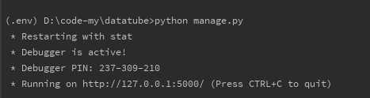
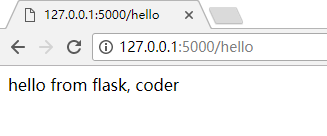

----

**文件目录的情况**

----
项目文件的分布结构主要有两个模式:功能式和分区式。

1. 功能式

    功能式架构就用代码在应用中作用来区分。例如：所有模板放到同一个文件夹中，静态文件放在另一个文件夹中，而视图放在第三个文件夹中。
    ```
    yourapp/
        __init__.py
        static/
        templates/
            home/
            control_panel/
            admin/
        views/
            __init__.py
            home.py
            control_panel.py
            admin.py
        models.py
    ```
    这样，一个文件夹包含所有该功能的所有文件，应用内的各种小的页面或者应用就不再区分。
2. 分区式  

    分区式和功能式的区分就是，文件的划分是以代码的应用独立性来划分的。在一个文件夹，包含着自己这个子应用的模版、静态文件、视图等文件。例如：网站的业务操作模块的所有模版、静态文件、视图等在一起，而后台管理的所有文件夹在另一个文件夹中。
    ```
    yourapp/
        __init__.py
        admin/
            __init__.py
            views.py
            static/
            templates/
        home/
            __init__.py
            views.py
            static/
            templates/
        control_panel/
            __init__.py
            views.py
            static/
            templates/
        models.py
    ```

文件结构的不同，是存放的逻辑不同。对于应用本身不会有很大的影响，主要取决于应用中的各个模块之间的联系是否紧密，管理的逻辑是否更贴合实际，更加便利。  
当应用内模块联系紧密，功能式架构的可能更合适一些。如果每个模块之间的独立性很强，仅仅共享少许的模型和配置文件，那么分区式是更好的选择。

在看了文件结构后，要把项目的框体搭建起来。
```
datatube/
    datatube/
        interface/
            __init__.py
            demo.py
        model/
        __init__.py
        config.py
    .env/
    manage.py
```

以下是各文件内容

datatube/datatube/config.py   
```
class Config(object):
    pass


class DevConfig(object):
    DEBUG = True
    SQLALCHEMY_DATABASE_URI = 'sqlite:///D:\code-my\data.db'
    SQLALCHEMY_TRACK_MODIFICATIONS = False

```

datatube/datatube/interface/demo.py
```
from datatube import app


@app.route('/hello')
def helloproject():
    return 'hello from flask, coder'

```

datatube/\_\_init\_\_.py
```
from flask import Flask

# 初始化应用
app = Flask(__name__)

# 从config中加载配置文件内容 config上线模式 devConfig开发模式
app.config.from_object(DevConfig)

from datatube.interface import demo
```


datatube/manage.py

```
from datatube import app

if __name__ == '__main__':
    app.run()

```

在IDE中或者CMD中运行 manage.py  

    
demo中申明了一个/hello的页面路由，在浏览器中打开地址就可以看到一下结果。  


基本上就完成了项目的初步搭建。