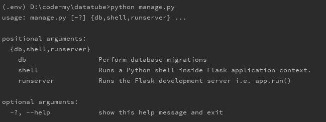

**命令行式管理**

------

前面我们创建的最简单的flask应用，在IDE中直接点击运行PY文件跑起来去浏览器访问的。实际的应用不能这样，应该有个命令行来控制。

请出flask众多扩展中的： [flask-script](http://flask-script.readthedocs.io/en/latest/)
1. 安装
    ```
    pip install flask-script
    ```

2.  官方的示例
    ```
    from flask_script import Manager

    from myapp import app # 你的flask app

    manager = Manager(app)

    @manager.command
    def hello():
        print "hello"

    if __name__ == "__main__":
        manager.run()
    ```

3. 项目中的应用
    改造一下创建的项目  
      
    datatube/datatube/\_\_init\_\_.py  
    引入flask-script中的Manager,初始化manager来管理初始化的flask应用app。
    ```
    from flask import Flask
    from flask_script import Manager
    from flask_sqlalchemy import SQLAlchemy

    from datatube.config import DevConfig

    # 初始化应用
    app = Flask(__name__)

    # 从config中加载配置文件内容 config上线模式 devConfig开发模式
    app.config.from_object(DevConfig)

    # 初始化数据库
    db = SQLAlchemy(app)

    # 初始化manager
    manager = Manager(app)

    # command加载DB命令,可以使用migrate
    manager.add_command('db', MigrateCommand)

    from datatube.interface import demo
    ```

    datatube/manage.py  
    这里不是引用app了，而是引用了manager
    ```
    from datatube import manager


    if __name__ == '__main__':
        manager.run()

    ```


这样，完成了使用manager来控制应用启动的方法，测试一下：  

在环境中进入CMD窗口，使用命令  
```
python manage.py 
```
会看到  
  
提示告诉我们，要用runserver来启动。

那么输入  
```
python manage.py runserver
```

就可以看到正常启动的信息了。