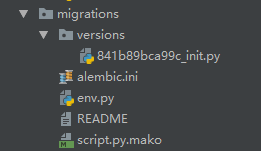

**数据库变更和升级的问题**

------

背景    
开发过程中，虽然绝大多数的项目开发之前都会完成数据库的表结构进行设计。但是随着一些需求的深入和业务的探索，不可避免的会出现数据模型需要被修改的问题。

flask中，我们会使用一些ORM框架来解决我们的问题。例如前面提及的flask-sqlalchemy，是对flask应用增加sqlachemy支持的扩展插件。
创建了各种数据模型在应用之中，怎么去更好的记录数据库结构的变化和怎么实现数据库修改的前后滚动呢？大神们已经给我们准备好了好道具：Alembic。

>Alembic为我们提供了好的数据库修改记录和升降级的功能。实现了一个类似GIT一样的功能。

而在flask中也有相应的扩展插件：[flask-migrate](http://flask-migrate.readthedocs.io/en/latest/)

------

1. 安装flask-migrate   
    ```
    pip install flask-migrate
    ```

2. 应用部署
    修改应用中的相关文件。  
    datatube/datatube/model/user.py

    ```
    from datatube import db


    class User(db.Model):
        __tablename__ = 'con_user'
        id = db.Column(db.INTEGER, primary_key=True)
        name = db.Column(db.String(30))
        secretkey = db.Column(db.String(100))
        status = db.Column(db.Boolean)

        def __init__(self, name, status):
            self.name = name
            self.status = status

        def __repr__(self):
            return 'User %r，Status % r' % (self.name,   self.status)

    ```

    datatube/interface/rolecontrol.py

    ```
    from flask import jsonify

    from datatube import app
    from datatube.model.user import User


    @app.route('/user')
    def getalluser():
        userlist = User.query.all()
        querycube = []
        print(userlist)
        for u in userlist:
            u_json = u.to_json()
            querycube.append(u_json)
        return jsonify(querycube)

    ```
    datatube/datatube/\_\_init\_\_.py   
    

    ```
    from flask import Flask
    from flask_migrate import Migrate, MigrateCommand
    from flask_script import Manager
    from flask_sqlalchemy import SQLAlchemy

    from datatube.config import DevConfig

    # 初始化应用
    app = Flask(__name__)

    # 从config中加载配置文件内容 config上线模式 devConfig开发模式
    app.config.from_object(DevConfig)

    # 初始化数据库
    db = SQLAlchemy(app)

    # 初始化migrate
    migrate = Migrate(app, db)

    # 初始化manager
    manager = Manager(app)

    # command加载DB命令,可以使用migrate
    manager.add_command('db', MigrateCommand)

    from datatube.interface import demo
    from datatube.interface import rolecontrol

    ```

3.  使用flask-migrate来更新升级

    进入cmd,进入环境：   
    ```
    python manage.py db init
    ```
    这时候我们可以看到应用目录先生成了一个migrations文件夹    

    再输入  

    ```
    python manage.py db migrate -m "init"
    ```
    migrations文件件中的versions多出了一个py文件：  
        
    versions里面的这个文件就是刚才migrate操作后生成的文件，里面包含了此次对数据库变更的记录。

    再输入

    ```
    python manage.py db upgrade
    ```

    upgrade语句将自动读取刚才生成的文件，将数据库结构更新到数据库中。多处修改一次完成，不需要在手动去数据库用SQL一句句操作。

4. 对数据库的回滚

    ```
    # 获取 History ID
    python manage.py db history


    # 回滚到某个 history
    python manage.py db downgrade <history_id>
    ```
    用以上的操作回滚到历史上的一个数据库版本。用法和GIT类似，依旧十分方便。


以上就是使用flask-migrate来管理数据库结构变更的方法了。

