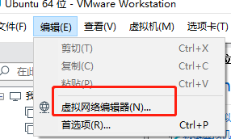
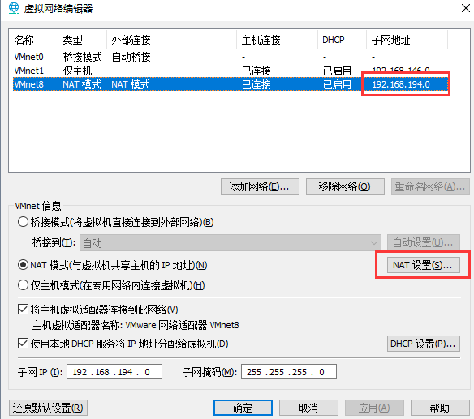
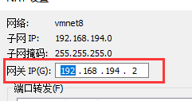
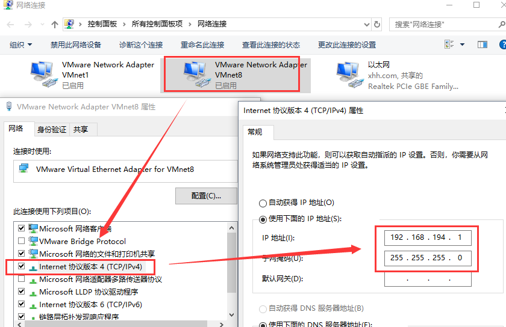
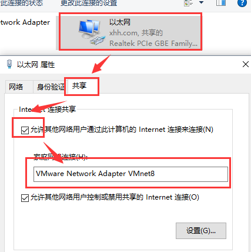
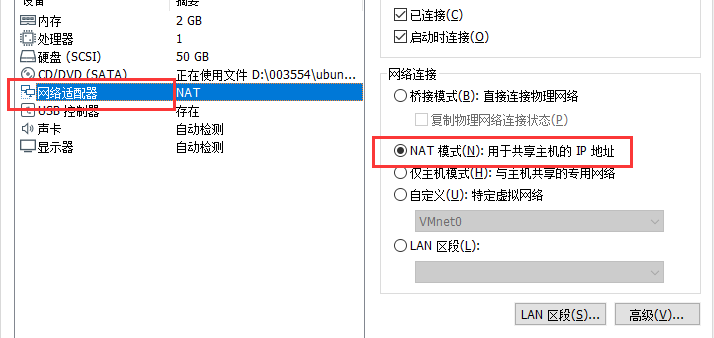
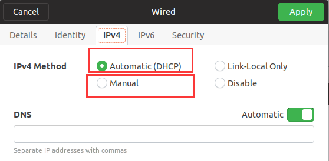
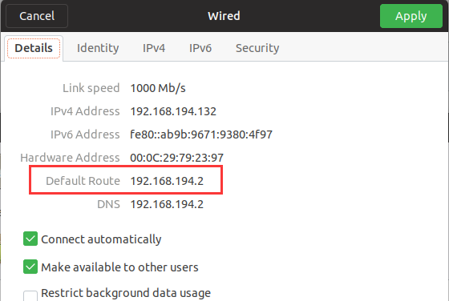

**vmware安装ubuntn，联网且宿主机访问**

-----
## 目录

* [安装Ubuntu](#安装Ubuntu)
* [联网且宿主机访问](#联网且宿主机访问)
* [配置SSH链接](#配置SSH链接)

### 安装Ubuntu
1. 首先要下载一个[vmware](https://www.vmware.com/)
2. 安装好vmware后需要去下载[ubuntu](https://www.ubuntu.com/index_kylin)的镜像，可以选择desktop版本，也可以选择server版本。desktop有图形界面更好上手一些。
3. 都下载完成后，安装vmware，并创建ubuntu虚拟机。记得安装vmware tools，获得更好的使用效果。


### 联网且宿主机访问

装了虚拟机学习，希望自己在宿主机上能使用SSH链接，虚拟机也能够上网安装一些需要的道具。
我们对vmware的NAT网络做一些设定就可以达到了。       
1. 打开vmware的虚拟网络编辑器       

2. 选中NAT模式(图中的VMnet8)，点击NAT设置，并将网关IP设置与VMnet8相同的子网网段。如NAT设置图里面的192.168.194.2      

3. 调整WIN10中的适配器设置。
    * 看到VMnet8的适配器后，修改它的IPV4地址，默认网关为空缺。如下图所示：       
    

    * 调整我们自己本身的物理网卡的适配器，将网络共享给VMnet8。如下图所示：      
    

4. 外部设置好后，启动装好的虚拟机。将虚拟机的网络适配器上选中刚才配置好的NAT适配器上。此处选的NAT就是VMnet8，自定义的或略微不同请选择相应的。
    

5. ubuntu系统中开启自动获取网络地址或者手动指定一个在DHCP范围内的地址。
    * 选中Automatic就是自动获取，选取Manual就是手动设定。注意要把默认网关写成在前面设定的的NAT网关IP      
    
    * 生效后会显示地址为：      
    

配置到这里就可以完成了,宿主机和虚拟机是可以相互PING通，并且虚拟机是可以上网的。

[↑ 回到目录](#目录)


### 配置SSH链接
1. ubuntu destop一般是没有SSH支持的，先试一下，启动终端输入：
```
ssh localhost
```
2. 如果出现了下面的信息，就没有安装。装一下openssh-server。
```
ssh: connect to hostlocalhost port 22: Connection refused 
```
3. 安装openssh-server：
```
sudo apt-get install –y openssh-server 
```
4. 安装完成后启动ssh
```
service ssh start 
```
启动完成后，就可以通过SSH的方式链接ubuntu的虚拟机，用命令行的形式来控制liunx。

5. SSH工具有以下的推荐：           
[MobaXterm](https://mobaxterm.mobatek.net/)     
[xshell](https://www.netsarang.com/products/xsh_overview.html)


[↑ 回到目录](#目录)