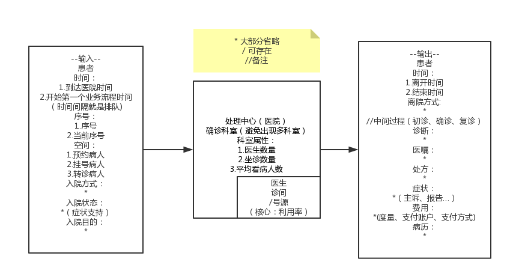
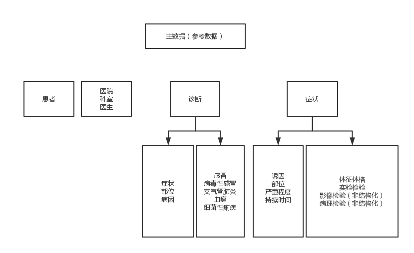

1.流程模型分析规则
输入端，处理中心，输出端的处理概念。
例：

2.对三端的重点分析
(1)运营  ---> 流程、高效、低成本   (精 益)  
(2)资源效率  --->  投资回报率  (集中在处理中心上、维修和保养都是由资源效率来派生的、业界标准OEE、可用率、开放率、利用率、周转率) exp: 床位  
(3)患者服务 --->  (就诊过程中的患者服务 PS:就是业务流程信息的共享和提示)  
(4)临床  ---> 提高医生的诊断正确率(开药、处方(处方的有效率))  
(5)随访 ---> (因为产生数据更多，将之改为子流程)  
(6)治疗 ---> (因为产生数据更多，将之改为子流程)  

3.根据需求的模型建设(包含主数据建设)
