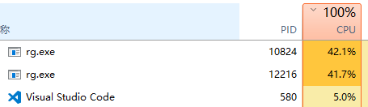
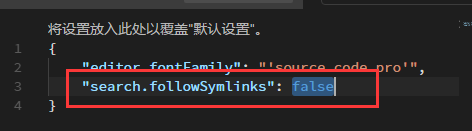

vscode背靠微软帝国，然后有很多好用的插件，我就在安利之下，不用sublime转到门下。唯一不好的就是不能在一个vscode中打开多个project。
听闻1.18版本开始支持了，欣然更新。结果打开以后发现，CPU怎么占满了？！


问题的反馈连接[问题的官方回答](https://github.com/Microsoft/vscode/issues/35659)
这个问题说是由使用了cnpm或其他的源导致的。

目前已经有了两种临时解决方法：

*  修改配置文件
>The upcoming 1.18 release has a new setting `"search.followSymlinks"` that you can set to false as an alternative workaround for this issue. (From[#37000](https://github.com/Microsoft/vscode/issues/37000).)

将search.followSymlinks由true改为false


* 修改cnpm的设置
```
cnpm install --by=npm
```
这个方法我没有试过，可能对要使用cnpm的人来说会有困扰。但是网上的结果来看，是成功的。

相比下，更推荐第一种。
期待vscode下次更新中这个问题能有好的解决。


