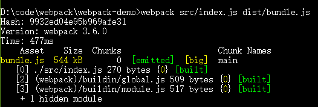
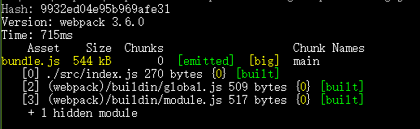

--------
* 安装
    首先要安装一个[node.js](https://nodejs.org/en/)的环境。windows的环境下，安装是很简单的。注意的地方是要将ADDtoPath加上。

    然后安装[webpack](https://webpack.js.org/)。安装有全局和本地安装,这里使用全局安装。
    打开cmd，使用命令：
    ```
    npm install webpack -g #全局安装
    ```
    使用npm安装因为npm服务本身在国外速度比较慢，可以切换使用淘宝镜像来安装。
    ```
    $ npm install -g cnpm --registry=https://registry.npm.taobao.org
    cnpm install webpack -g #全局安装
    ```
    
--------
* 简单使用
    在CMD进入到自己要创建项目的目录。

    ```
    mkdir webpack-demo
    ```
    在文件夹中可以看到一个新的文件夹webpack-demo,在CMD中进入这个文件夹，进行下一步：
    ```
    npm init -y
    ```
    执行完后，我们在webpack-demo中看到了一个package.json文件。简单的来说，这个文件有项目各种描述，列清依赖包用于构建环境的作用。输入下一个命令：
    ```
    npm install --save-dev webpack
    ```
    这是通过在本项目中安装webpack,是局部安装的。在webpack-demo的文件下面，我们可以看到一个新的叫做node_modules的文件夹。同时，在package.json中可以看到，devDependencies下多了一个"webpack": "^3.6.0"这样带着版本号的条目。
    在文件夹中创建如下的目录和每个文件的内容：
    ```
     webpack-demo
    |- package.json
    + |- index.html
    + |- /src
    +   |- index.js
    ```
    src/index.js
    
    ```
    function component() {
    var element = document.createElement('div');

    // Lodash, currently included via a script, is required for this line to work
    element.innerHTML = _.join(['Hello', 'webpack'], ' ');

    return element;
    }

    document.body.appendChild(component());
    ```
    index.html
    ```
    <html>
    <head>
        <title>Getting Started</title>
        <script src="https://unpkg.com/lodash@4.16.6"></script>
    </head>
    <body>
        <script src="./src/index.js"></script>
    </body>
    </html>
    ```
    这时候在浏览器中打开index.html的时候是可以看到输出了一个Hello webpack的页面。在index.html的页面中，
    `<script>`的标签存在隐性的依赖，index.js需要没有被声明的lodash才能运行。用这种方式会导致一些问题：
        1.依赖的库之间的关系没有很明显的显示出来。
        2.如果依赖关系错了或者里面的代码不正确，程序就不能运行了。
        3.依赖包被包含但是没有被使用，就要去被下载一些不必要的依赖而影响性能和体验。
    如果用webpack来管理就可以避免这些。
    调整一下目录和修改一下文件：(+表示新增该行，-表示删除该行)
    ```
    webpack-demo
    |- package.json
    + |- /dist
    +   |- index.html
    - |- index.html
    |- /src
        |- index.js
    ```
    调整完成后，要把依赖的lodash加入到依赖中。
    ```
    npm install --save lodash
    ```
    修改src/index.js，用import的方式加载lodash,把之前是用的`<script>`标签删除。
    ```
    + import _ from 'lodash';
    +
    function component() {
        var element = document.createElement('div');

    -   // Lodash, currently included via a script, is required for this line to work
    +   // Lodash, now imported by this script
        element.innerHTML = _.join(['Hello', 'webpack'], ' ');

        return element;
    }

    document.body.appendChild(component());
    ```
    修改一下dist/index.html。
    ```
    <html>
    <head>
        <title>Getting Started</title>
    -   <script src="https://unpkg.com/lodash@4.16.6"></script>
    </head>
    <body>
    -    <script src="./src/index.js"></script>
    +    <script src="bundle.js"></script>
    </body>
    </html>
    ```
    用webpack打包后作为bundle.js输出。
    ```
    webpack src/index.js dist/bundle.js
    ```

    打包成功后会有提示：
    

    这个时候在浏览器中打开index.html依旧看到了hello webpack内容的页面证明成功了。
---------
    上面这只是一个单个的.JS打包，项目中往往有很多的不同的模块，所以我们使用config文件来配置。
* 配置文件

    创建一个webpack.config.js文件：

    ```
    const webpack = require('webpack');
    const path = require('path');

    module.exports = {
    entry: './src/index.js',
    output: {
        filename: 'bundle.js',
        path: path.resolve(__dirname, 'dist')
    }
    };
    ```
    随后在CMD中执行命令,即可完成打包：

    ```
    webpack --config webpack.config.js
    ```
    
    


    同样是打包，但是使用配置文件，我们可以一次性打包大量的文件。
-----------
上面我们是使用了webpack命令，总是重复的输入也是很麻烦的。我们修改一下NPM的配置文件来达到一个快速打包的方法。
* NPM Scripts

    在package.json的scripts中添加一句："build": "webpack"
    ```
    {
      "name": "webpack-demo",
      "version": "1.0.0",
      "description": "",
      "main": "index.js",
      "scripts": {
    + "build": "webpack",
      "test": "echo \"Error: no test specified\" && exit 1",
      },
      "keywords": [],
      "author": "",
      "license": "ISC",
      "devDependencies": {
        "webpack": "^3.6.0",
      },
      "dependencies": {
        "lodash": "^4.17.4"
      }
    }

    ```
    在CMD的直接使用 npm run build 就是可实现和webpack命令行一样的操作了。